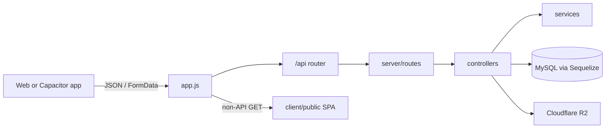

# Architecture

MSP-MIU is a monorepo that serves both the Express API and the built React SPA from one Node process.

## High-level layout

```
Back-End/
├── app.js                 # Process entry: CORS, JSON, /api, static SPA, quiz timer
├── client/                # React + Vite + Capacitor (Android/iOS)
├── server/                # Express API (routes, controllers, models, services)
├── docs/                  # This documentation
└── package.json           # Workspaces: client + server
```

## Request flow



1. [`app.js`](../app.js) loads `.env`, applies CORS and body parsers, mounts API at `/api`.
2. [`server/server.js`](../server/server.js) mounts route groups and calls `syncModels()`.
3. Controllers use Sequelize models and services (evaluation, quiz lifecycle, timeslots, email).
4. Uploads go to Cloudflare R2 when configured, otherwise `server/uploads/` (also served at `/uploads`).
5. Non-API routes fall through to the Vite build in `client/public` (SPA `index.html`).

## Backend layers (`server/`)

| Path | Role |
|------|------|
| `config/` | DB (`db.js`), R2 client (`cloud.js`), evaluation configs |
| `models/` | Sequelize models; associations in `models/index.js` |
| `routes/` | Express routers mounted under `/api/*` |
| `controllers/` | Request handlers |
| `middlewares/` | JWT auth, roles, `adminAuth`, judging, multer |
| `services/` | Quiz auto-submit, timeslots, announcements, code/Lighthouse eval |
| `utils/` | JWT, email, season filter, uploads, scoring, logging |
| `scripts/` | Schema patches and email/ops CLIs |

## Frontend layers (`client/src/`)

| Path | Role |
|------|------|
| `AppRouter.jsx` | Lazy-loaded routes |
| `pages/` | Public site, competitions, admin tabs |
| `services/api.js` | Monolithic `ApiService` (native `fetch`, not Axios) |
| `context/SeasonContext.jsx` | Active season for UI filters |
| `hooks/useSiteContent.js` | CMS key loading with local fallbacks |
| `layoutpages/` | Navbar, Footer, SiteLayout |
| `components/quiz*` | Quiz competition UI |

## Background jobs

On listen, `app.js` runs `runAutoSubmitExpiredAttempts` after 10s and every 60s so timed quiz attempts that expire without a client submit are closed server-side.

## Season scoping

Many club entities carry `season_id` (board, events, sponsors, competitions, announcements, applications, members, users, admin notifications). List endpoints typically accept `season_id` / `season` query params via [`server/utils/seasonFilter.js`](../server/utils/seasonFilter.js). See [Seasons](./seasons.md).

## Auth dual gates

- **Role gate:** `User.role` (`member`, `board`, `admin`, `competitor`, `judge`) via `verifyRole` / `authorize`.
- **Admin panel gate:** `adminAuth` requires a Board row in the **default season** with position President, Vice President, or Head of department 1 (SWD) or 2 (Technical Training).

See [Auth & roles](./auth-and-roles.md).

## Production vs local

| Mode | Typical setup |
|------|----------------|
| Local | `npm run dev` — Vite on one port, API via `app.js` (`PORT`) |
| Production | `npm run build` then `npm start` — Express serves API + `client/public` |
| Native apps | Capacitor builds hit production API (`VITE_PRODUCTION_API_URL` / `https://msp-miu.tech/api`) |
