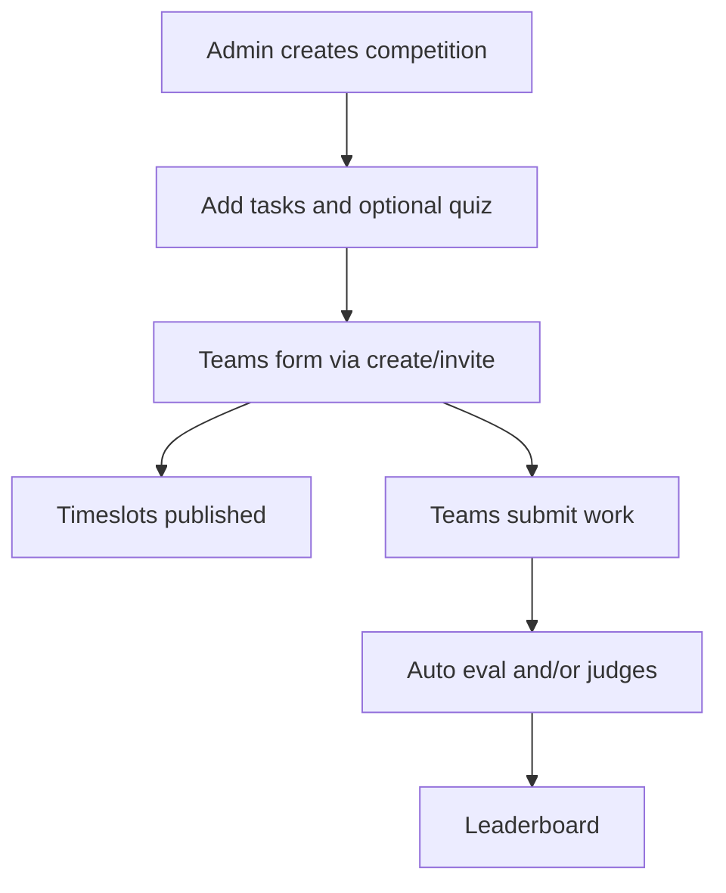

# Competitions and quizzes

Largest feature area beyond the classic club CMS: competitions, teams, timeslots, submissions, automated evaluation, judging, and timed quizzes.

## Competition lifecycle

## Core flows

### Teams

- Create team: `POST /api/teams` (`optionalAuth`).
- Invite: `POST /api/teams/:id/invite`.
- Accept/decline via invitation token endpoints; new users can accept without a prior account.
- Client routes: create-team, team workspace, accept-team-invitation.

### Timeslots

- Public selection links: `GET/POST /api/competitions/:id/timeslots/selection`.
- Workspace (authenticated): `GET/POST /api/competitions/:id/team/:teamId/timeslots`.
- Admin CRUD + publish links + assign/unassign under `/api/admin/competitions/:id/timeslots*`.
- Service: `server/services/competitionTimeslotService.js`.

### Submissions and evaluation

- Upload: `POST /api/submissions` (multipart `file`).
- Team view: `GET /api/submissions/competitions/:competitionId/teams/:teamId`.
- Judge list/grade: requires `authorizeJudgingAccess`.
- Auto evaluation: `POST /api/evaluation/run/:submissionId` (admin/board).
- Judge score: `POST /api/evaluation/judge/:submissionId`.
- Services: `codeEvaluator`, `evaluationRunner`, `lighthouseRunner` (needs `CHROME_PATH` for Lighthouse).

### Task-quiz marks

- Judges: `GET /api/evaluation/task-quiz/:competitionId/team/:teamId`.
- Team self view: `GET /api/evaluation/my-task-quiz/:competitionId/team/:teamId`.
- Client: `/competitions/:id/team/:teamId/marks`.

### Competition announcements

Nested under `/api/competitions/:competitionId/announcements` with optional email resend. Broadcast helpers live in `competitionAnnouncementBroadcast`.

## Quizzes

### Content (admin)

Under `/api/admin/competitions/:id/quiz*` — get/patch quiz, questions, options.

### Taking a quiz

| Step | Endpoint |
|------|----------|
| Load quiz | `GET /api/quizzes/:id` |
| Start attempt | `POST /api/quiz_attempts` |
| Save answer | `POST /api/quiz_attempts/:attemptId/answers` |
| Submit | `PATCH /api/quiz_attempts/:attemptId` |
| Prior attempt | `GET /api/quizzes/:quizId/attempts/:userId` |

Client: `/quizpage`, `/quizpage/:quizId`, `/quizpage/:quizId/take/:step` plus `QuizCompetitionPanel`.

### Auto-submit

[`quizAttemptLifecycle`](../server/services/quizAttemptLifecycle.js) runs from `app.js` every 60s (and once after 10s) to submit expired attempts. Time helpers use Egypt/Cairo conventions in `cairoQuizTime` / client `quizTimeEgypt`.

## Public competition reads

- List/detail, tasks, leaderboard, teams, my-team (auth).
- Mutations for create/update: admin/board; delete competition: `admin` role only on public competitions router.

## Admin competition UI

- Tabs: Competitions list + dedicated `/admin/competition-management/:competitionId`.
- Requires full `adminAuth` (not registrations-only).

## Test / simulation scripts

- `server/scripts/simulateCompetitionLifecycle.mjs`
- `server/scripts/testCompetitionCreateTeamFlow.mjs`

See [Scripts & ops](./scripts-and-ops.md).
