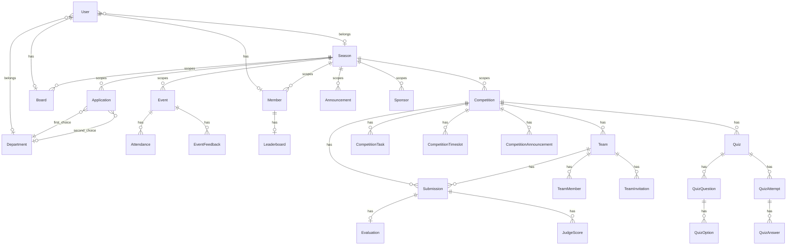

# Data model

ORM: **Sequelize** on **MySQL**. Models live in [`server/models/`](../server/models/); associations are wired in [`server/models/index.js`](../server/models/index.js).

## Entity overview

## Core club models

| Model | Purpose |
|-------|---------|
| `User` | Accounts; roles; optional `department_id`, `season_id` |
| `Department` | Club departments |
| `Member` | Member profile linked to `User` |
| `Board` | Board profile (position, dept, season) linked to `User` |
| `Application` | Join applications (1st/2nd department choice) |
| `PasswordToken` | Activation / password-reset tokens |
| `Event` / `EventFeedback` / `Attendance` | Events, feedback, attendance requests |
| `Session` | Training sessions (legacy/light use; no associations wired) |
| `Leaderboard` | Per-member ranking |
| `Sponsor` / `Announcement` / `Suggestion` | Public club content |
| `Season` | Academic/club season; scopes many tables |
| `SiteContent` | CMS key/value JSON (no Sequelize associations) |
| `EmailTemplate` | Editable email templates |
| `AdminNotification` | Admin activity feed |

## Competition models

| Model | Purpose |
|-------|---------|
| `Competition` | Competition definition (`config` JSON for judging, etc.) |
| `CompetitionTask` | Tasks (e.g. code submit, task-quiz) |
| `CompetitionAnnouncement` | Per-competition announcements + email |
| `CompetitionTimeslot` | Slots assignable to teams |
| `Team` / `TeamMember` / `TeamInvitation` | Team formation |
| `Submission` | Team file/code submissions |
| `Evaluation` | Automated evaluation results |
| `JudgeScore` | Manual judge scores |
| `Quiz` → `QuizQuestion` → `QuizOption` | Quiz content |
| `QuizAttempt` → `QuizAnswer` | Timed attempts |

## Course & Learning models

| Model | Purpose |
|-------|---------|
| `Course` | Course definition (`title`, `description`, `thumbnail_url`, `status`, `max_attendance`, `season_id`) |
| `CourseLesson` | Individual sessions / lessons in a course |
| `CourseLessonMaterial` | Lesson media: YouTube embeds, files, docs |
| `CourseEnrollment` | Student registrations and access tokens |
| `CourseLessonProgress` | Lesson completion markers |
| `CourseLessonAttendance` | Per-session / lesson attendance records for certificate eligibility |
| `CourseAnnouncement` | Announcements / broadcast communications for courses |

## Sync behavior

`syncModels()` prefers plain `sequelize.sync()`. Setting `DB_SYNC_ALTER=true` enables `alter: true`, which can hit MySQL index limits — use [patch scripts](./scripts-and-ops.md) instead for schema evolution.
